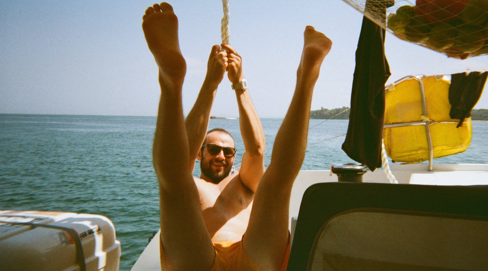

# About

My name is Dan and I like computers. I am a software developer and reverse engineer, and I like to poke around at video games during my free time.

When not at my desk I am usually taking a leisurely stroll with a friend or podcast.

I spend a lot of time collecting songs that I [like to live to](https://open.spotify.com/playlist/2lUlj6v5jLZbZH445sVQ1E?si=fa9cbd9186b244be) and [like to dance to](https://open.spotify.com/playlist/1jwv5F1BttjtnspQjZtYZz?si=723e33487db249e3).

I love the ocean and the self-reliant, tight-knit communities of sail boats. I crewed on a Pacific crossing in the spring of 2022 from Panama to French Polynesia. The picture above is of me testing out the strength of a rope I spliced.

I have a strong interest in community living and cohousing.

I am in love.

I am fascinated by games that blend the real, the virtual, and the imaginary. Some examples are [ARGs](https://en.wikipedia.org/wiki/Alternate_reality_game), and meta-narratives that grow from system-driven games like [Eve: Online](https://web.archive.org/web/20090208102142/http://www.shacknews.com/featuredarticle.x?id=527) or [XCOM](https://old.reddit.com/r/Xcom/comments/3f0jox/who_was_your_favourite_soldier_and_why/) or even [specific game servers](https://2b2t.miraheze.org/wiki/2b2t).

I grew up in the south, was educated in the midwest, lived and worked on the east coast, and have settled on the west one.

My favorite bands of all time are The Avalanches and Phoenix.

My favorite food is raw fish (and oysters).

I was blessed with loving family and friends, and I'm overall having a good time.
