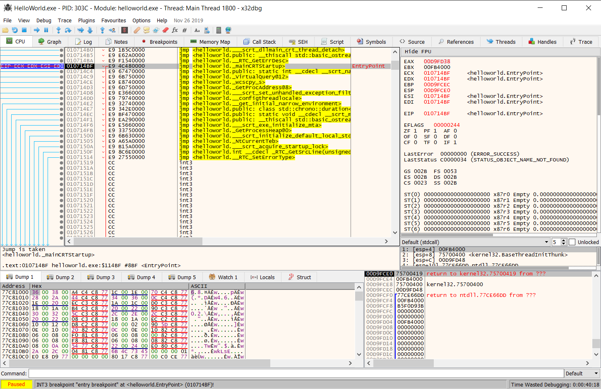
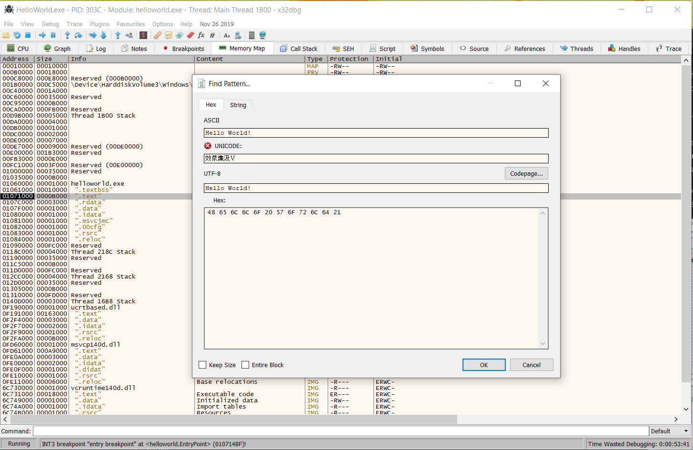
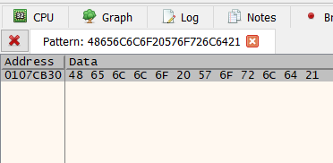
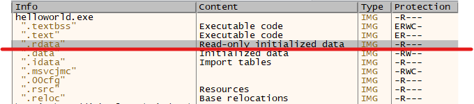
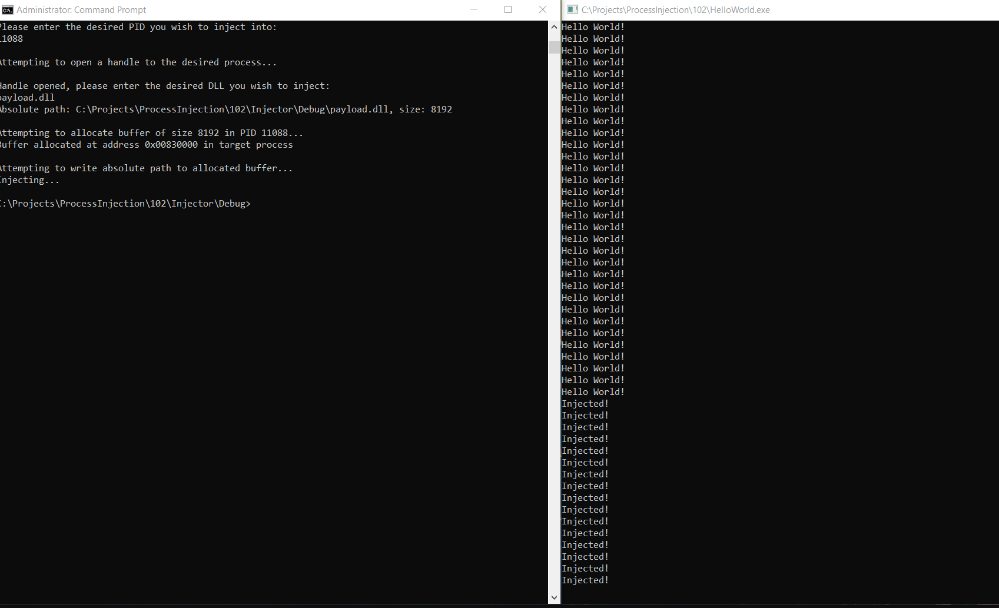

# Process Injection 102: VirtualProtect
_This blog post is a continuation of a series on Process Injection. To see part one click [here](../Process-Injection-101-Hello-World)!_

_The accompanying source files for this blog post are on [GitHub](https://github.com/MayerDaniel/ProcessInjection/tree/master/102)._

Now that you have successfully run code in the address space of another process, it is time to make that actually code do something. Since `HelloWorld.exe` just prints `Hello World!` over and over again, let's change the string being printed.

## Finding offsets

_While not necessary to follow this blog, it is useful to understand a little bit about Portable Executable (PE) files, which is the file format of Windows Executable files. The microsoft docs are [here](https://docs.microsoft.com/en-us/windows/win32/debug/pe-format), and [Corkami](https://github.com/corkami/pics/blob/master/binary/pe101/README.md) has some great visual resources._

Fire up 32-bit x64dbg and open up `HelloWorld.exe` (you can just drag it in), and hit run. x64dbg will stop at the entry point for you.



At this point you are done debugging 😄 press run again to allow the `HelloWorld.exe` to execute (The bottom left corner should say `Running`).

Open up the `Memory Map` tab and and press `ctrl+b`. A search window will pop up, allowing you to search for values in memory. Input `Hello World!` in the `ASCII` field:



After searching, one result should be returned - this is address of the string you want to change:



**NOTE**: The address you see will likely be different than the screenshot above! This is due to [Address Space Layout Randomization (ASLR)](https://en.wikipedia.org/wiki/Address_space_layout_randomization). ASLR randomizes the base address of `HelloWorld.exe`, but the offset of your target string from the base address `HelloWorld.exe` in memory will always be the same.

With this knowledge, note the address of the target string, in this example it is `0x0107CB30`. Then return to the memory map and note the base address of  `HelloWorld.exe`, in this case it is `0x01060000`. The difference of `0x0107CB30 - 0x01060000 = 0x1CB30` gives you the offset of your target string. This offset will not change.

One more characteristic to note is that your target string is in a read-only portion of memory. The payload will have to account for this:



## Creating the payload

Create a new DLL in Visual Studio like you did in [101](https://www.mayer.cool/2020/04/19/Process-Injection-101-Hello-World/#Creating-the-payload-DLL). This payload will only require 4 API calls to overwrite your target string:

* [GetModuleHandle] to find the randomized base address of `HelloWorld.exe`. This base address will be added to the offset `0x1CB30` to get the address of the target string
* [VirtualProtect] to turn the read-only portion of memory where the target string resides into writeable memory*
* [WriteProcessMemory] in conjuction with [GetCurrentProcess] to overwrite the now-writeable memory where target string resides

*You should call VirtualProtect again at the end of our payload code to make the string read-only again. This just ensures you leave the program in as similar of a state as possible after modifying it.

#### GetModuleHandle and Calculating the target string's address

These two lines should exist outside of the switch statement in `DllMain`, otherwise Visual Studio will complain undefined variables could be referenced within the switch.

```cpp
// https://docs.microsoft.com/en-us/windows/win32/api/libloaderapi/nf-libloaderapi-getmodulehandlea
BYTE* stringAddr = (BYTE*)GetModuleHandle(TEXT("HelloWorld.exe")) + 0x1CB30;
LPVOID stringAddress = LPVOID(stringAddr);
```
Take note of the casting going on. This is necessary because you cannot do pointer arithmetic on a void pointer. Why? because C++ does not know the size of each unit of data being pointed at. Casting the pointer as a `BYTE` pointer allows C++ to know the arithmetic is adding `0x1CB30` to the pointer to move it `0x1CB30` _bytes_ (size of 4 bits) forward. If that explanation didn't make any sense, try [this Quora thread about it](https://www.quora.com/Why-is-pointer-arithmetic-with-%E2%80%9Cvoid*%E2%80%9D-considered-bad-What-are-some-bad-scenarios-for-this-application).

After the pointer arithmetic is done, you can cast the pointer back to `LPVOID`, which is what the other API calls expect as an argument.

#### First VirtualProtect

Something else to note is that it is dangerous to overwrite data of length *x* with data of length > *x*. You might overwrite other data the program expects to be there for another purpose, akin to a buffer overflow. In this case the length of the target string is `0xE`, so only make `0xE` bytes writeable.

```cpp
    DWORD oldPerms;
    // https://docs.microsoft.com/en-us/windows/win32/api/memoryapi/nf-memoryapi-virtualprotect
    if (!VirtualProtect(stringAddress,
        0xE,   //Length of the string "Hello World!\n"
        PAGE_EXECUTE_READWRITE,
        &oldPerms //saves off the old permissions
    )) {
        printf("Error with VirtualProtect! %#010x", GetLastError());
        exit(0);
    }
```

#### WriteProcessMemory and GetCurrentProcess

```cpp
 // https://docs.microsoft.com/en-us/windows/win32/api/memoryapi/nf-memoryapi-writeprocessmemory
 // https://docs.microsoft.com/en-us/windows/win32/api/processthreadsapi/nf-processthreadsapi-getcurrentprocess
        if (!WriteProcessMemory( GetCurrentProcess(),
            stringAddress,
            "Injected!\n",
            0xc,
            NULL
        )) {
            printf("Error with VirtualProtect! %#010x", GetLastError());
            exit(0);
        }
```

#### Second VirtualProtect

```cpp
DWORD finalPerms;
        if (!VirtualProtect(stringAddress,
            0xE,
            oldPerms,
            &finalPerms
        )) {
            printf("Error with VirtualProtect! %#010x", GetLastError());
            exit(0);
        }
```

Voila! You should be able to see the print statement now change when you inject your DLL into `HelloWorld.exe`:



 As always you can check out the source for a completed payload on [GitHub](https://github.com/MayerDaniel/ProcessInjection/tree/master/102) if you run into trouble.

[GetModuleHandle]: https://docs.microsoft.com/en-us/windows/win32/api/libloaderapi/nf-libloaderapi-getmodulehandlea
[VirtualProtect]: https://docs.microsoft.com/en-us/windows/win32/api/memoryapi/nf-memoryapi-virtualprotect
[WriteProcessMemory]: https://docs.microsoft.com/en-us/windows/win32/api/memoryapi/nf-memoryapi-writeprocessmemory
[GetCurrentProcess]: https://docs.microsoft.com/en-us/windows/win32/api/processthreadsapi/nf-processthreadsapi-getcurrentprocess
