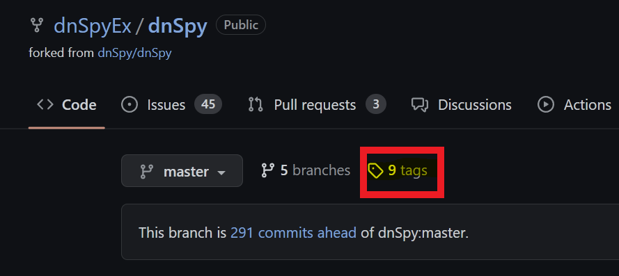
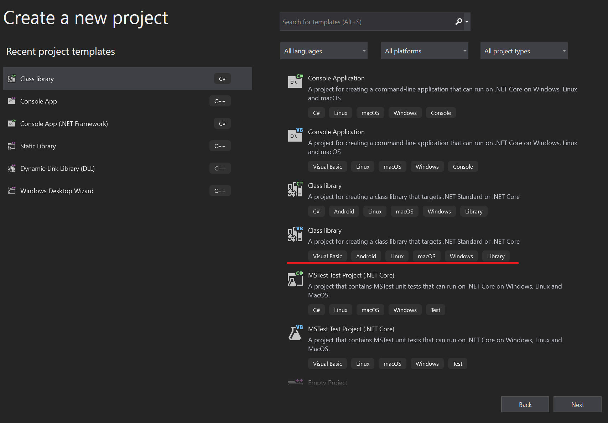

# Unity Hacking 101: Hacking with Reflection

_This tutorial is for Windows machines. And intended to be followed step-by-step. Associated materials can be found on GitHub [HERE](https://github.com/MayerDaniel/UnityHacking)_

I recently participated in the [Global Game Jam](https://globalgamejam.org/), where I spent 48 hours creating a game in Unity with a very talented team comprised of game industry professionals and a few novices like me. My contributions were modest and filled with spaghetti but with the help of the great game programmers on my team, I got a much better understanding of the basics of how the engine works. 

Unity is written in C#, a programming language for the .NET framework, which allows us to make use of [Reflection](https://learn.microsoft.com/en-us/dotnet/csharp/programming-guide/concepts/reflection), a very powerful tool set built into .NET which allows for the introspection and manipulation of running processes - we will talk more about this further down. 

Compiled C# also decompiles incredibly cleanly and with symbols, making Unity games a great place to start as well if you are interested in reverse engineering. To get a handle on the basics of Unity though, let's first do some plain ol' forward engineering.

## Snake: a Unity primer

Our target:


To get a basic understanding of how the engine works, I recommend you follow this tutorial to make a very basic snake game:

[Unity 2D Snake Tutorial](https://noobtuts.com/unity/2d-snake-game)

This will get you acquainted with the basic concepts of GameObjects and how C# scripting works within the engine to construct the game logic. 

<mark>PLEASE NOTE: Unity version matters!! I made my version of snake with 2021.3.16f1 - you should to! Otherwise some of my code further down may not work for you.</mark>

If you don't want to walk through it or are already familiar with Unity, I have included my build of the game on GitHub [HERE](https://github.com/MayerDaniel/UnityHacking/blob/main/101/snakebuild.zip?raw=true) (clicking this will download the zip file). The only difference between my build and the tutorial is I added the following line to reload the scene when you die:

```cs
SceneManager.LoadScene(SceneManager.GetActiveScene().name);
```

Now that we have our game to hack, let's hack it! Snake is nice because there's only one real way to cheat - we are going to give ourselves more tail squares without eating food! Lets figure out how to do that.

## DNSpy: A first foray into reverse engineering

For this part, we will need to download a .NET decompiler. This will allow us to look at our built snake game to get an idea of what Unity games look like when they are shipped. I recommend DNSpy since it also allows for debugging .NET assemblies relatively easily, even though we won't be doing that in this tutorial. It can be found [HERE](https://github.com/dnSpyEx/dnSpy). You can download a built copy of DNSpy under the "tags" tab on that page:



If you followed the tutorial, first build your game to a known location. Otherwise, unzip [my included build](https://github.com/MayerDaniel/UnityHacking/blob/main/101/snakebuild.zip?raw=true) to a known location. Navigate there and find the file located at `.\snake_Data\Managed\Assembly-CSharp.dll`. For most games, this is the file that holds most of the game logic written by the game designers. Drag this into the sidebar of DNSpy to decompile it.

In the sidebar, you should now be able to open up the default namespace inside of `Assembly-CSharp.dll`, which looks like little brackets with a dash next to them, and inspect the game logic of the classes within our snake game:


The nice thing about mucking around with other people's code is there are no rules about how you accomplish your goals. The path you take to give yourself extra tail squares on your snake is up to you. In my case, I took a look at the `Move` function inside the `Snake` class. Here is the decompiled function from DNSpy, copy/pasted here:


```cs
// Token: 0x02000002 RID: 2
public class Snake : MonoBehaviour
{
	// Token: 0x06000001 RID: 1 RVA: 0x00002050 File Offset: 0x00000250
	private void Move()
	{
		this.dir = this.tickDir;
		Vector2 v = base.transform.position;
		base.transform.Translate(this.dir);
		if (this.ate)
		{
			GameObject gameObject = Object.Instantiate<GameObject>(this.tailPrefab, v, Quaternion.identity);
			this.tail.Insert(0, gameObject.transform);
			this.ate = false;
			return;
		}
		if (this.tail.Count > 0)
		{
			this.tail.Last<Transform>().position = v;
			this.tail.Insert(0, this.tail.Last<Transform>());
			this.tail.RemoveAt(this.tail.Count - 1);
		}
	}
```

Great. So a quick look at this shows that there is a check within the `Move` function for the value of the boolean `ate`. If it is true, then we add to the tail. That means one way that we can ensure we add a square to our tail is to set `ate` to `true` for our snake, then call `Move`. We've already looked at the move function, so let's check out the `ate` field.

You can right click `this.ate` within the `Move` function in DNSpy and select `Analyze` in the menu that pops up. This will create a new analyzer window at the bottom that shows you where `this.ate` gets set and read, but we don't care about that so much because we are going to set it ourselves (checking these out could reveal another way to accomplish adding a tail, though!). For our method of adding to our tail we care more about the details of the `ate` field itself. For that, click `Snake.ate` in the Analyzer:


This will bring you to its definition within the `Snake` class, which I have included below:

```cs
// Token: 0x04000004 RID: 4
	private bool ate;
```

Ok, so it a boolean, and it is a private variable belonging to the class `Snake`. "Oh no!" you might say - "that means that no function outside the `Snake` class can access that class! This tutorial is over!" to which I say, cut the histrionics! Where there is a will there's a way. And that way is reflection!

## Reflection is the coolest part of .NET

Now,  in a game compiled in C, we would probably just find the struct of our instantiated `Snake` object once the game starts and flip the bit associated with the `ate` boolean to true. Which is very cool and hackery and you can check out my other tutorial on [finding and altering offsets in memory](/blog/Process-Injection-102-VirtualProtect) to see how to do something like that. But in .NET you can do something even cooler and hackery-er. You can write code that finds, reads, and alters instantiated objects as a built-in feature of .NET!

Using reflection, our basic game plan will be this:

1. Get code execution into the snake game at runtime through process injection.
2. Create a Unity GameObject that uses reflection to find the snake object in memory and alter it.
3. Have Unity load our GameObject into the game, at which point it will flip `ate` for the snake object in-game to true, call `Move`, and grow our tail.

## Injecting into the game

For this tutorial, we are going to let steps 1 and 3 be taken care of by talented folks over at https://www.unknowncheats.me/, and awesome online resource for learning game hacking. Someone there maintains a Unity injector that does a lot of the hard work of injecting into a Unity process, finding the functions necessary to load an object, and calling it with a pointer to whatever class you have compiled to give it. 

Building the injector is far more complex than what we are doing here, and while I am interested in recreating an injector for Unity one day, that ain't no 101 class. The injector we are going to use is called `SharpMonoInjector` and you can find it [HERE](https://github.com/warbler/SharpMonoInjector).

Same as with DNSpy, there is a compiled release under "tags" on the GitHub page. You can use either the GUI or CLI version, I will be using the CLI in my examples. Make sure you keep all contents of the zip you download in the same directory.

## Building a Proof of Concept

### Project Setup

We can break our payload into two steps. The first step is to build a signifier that we are executing code in Unity, which will get us set up with our boilerplate code. Then we can actually implement our cheat.

There are a few gotchas with how you need to set up your Visual Studio project, so let's go through it together.

First create a new "Class Library" project in Visual Studio.



When clicking through the options of your project, ensure that on the "Additional Information" page you select the target framework to be ".NET Standard 2.1", as this is the .NET profile that unity supports by default, and will be the profile of our snake game.


### Loader Boilerplate

Now, we will create our boiler plate loader. This is the class expected by our injector, and it mainly just creates a class from another namespace we create and put all of our cheat logic in. This boilerplate is from a great primer on Unity hacking posted on Unknown Cheats [HERE](https://www.unknowncheats.me/forum/unity/285864-beginners-guide-hacking-unity-games.html) - which was a really great resource for me. Honestly most of this blog post is redundant information from that post except for how to use reflection to access private functions and methods within GameObjects. Anyway, here's the boilerplate:


```cs
using System;
// We will import this straight from the game files!
using UnityEngine;
// Our namespace, which we will create in another file
using hax;


namespace cheat
{
    public class Loader
    {
        public static GameObject L;
        public static void Load()
        {

            // Create an instance of the GameObject
            Loader.L = new GameObject();

            // Add our class that will contain all of the cheat logic
            Loader.L.AddComponent<hax.Hacks>();

            // Tell Unity not to destroy our GameObject on level change
            UnityEngine.Object.DontDestroyOnLoad(Loader.L);
        }

        public static void Unload()
        {
            // Destroy our GameObject when called
            UnityEngine.Object.Destroy(L);
        }
    }

}
```

Now, give it a read over here because when you paste this into Visual Studio it will be full of red squigglies. That is because we haven't created our other file, which will contain the namespace `hax` and the class `hax.Hacks` yet, and we also haven't imported the Unity engine as a dependency. This is one of the other things that makes hacking games with a .NET engine so fun - you can give Visual Studio the actual DLLs shipped with the game as dependencies and integrate seamlessly with the IDE!

To add the Unity engine, go to your solution explorer and right click on "Dependencies > Add Project Reference". 


In the new dialogue, then press "Browse" on the left sidebar, and "Browse" again on the bottom bar. You'll see that I have already added a bunch of DLLs from Unity games so they show up in my history, but those won't be there when you open up this dialogue for the first time.


When the file selection dialogue pops up, navigate to the same `.\snake_Data\Managed\` directory inside the Snake build that you found `Assembly-CSharp.dll` in and and select `UnityEngine.dll`. Now do the same to add `UnityEngine.CoreModel.dll`. Once these have both been added as dependencies in your project you will be able to reference Unity engine functions and classes like `GameObject` in your code.

Great! A lot of red squigglies should now be gone. Now, let's make a first pass "hack" that will display a text box in game, and test it to ensure we have execution inside our game process.

### Injecting a GUI into the game

As our first pass in getting code execution within snake, we will make a small GUI component show up in the game, since we will want to tie our "hack" to a button within the game anyway. To do this we will make a new file within our visual studio project with the following boilerplate:


```cs
using System;
using UnityEngine;

namespace hax
{
    public class Hacks : MonoBehaviour
    {
        public void OnGUI()
        {
            //GUI code goes here!
        }
    }
}
```

The namespace `hax` and the class `Hacks` are just throwaway names, but the function `OnGUI` is an inherited function of every object within the Unity engine, and is the only function used for rendering and handling GUI events. In case you are wondering, the base object within the Unity engine is the `MonoBehavior` class that we are extending.

The following code is the most basic UI we can make, it is just a box with a label that then holds a small button with a label:

```cs
public void OnGUI()
        {
            // Create a window at the center top of our game screen that will hold our button
            Rect windowRect = new Rect(Screen.width / 2, Screen.height / 8, 120, 50);

            // Register the window. Notice the 3rd parameter is a callback function to make the window, defined below
            windowRect = GUI.Window(0, windowRect, DoMyWindow, "HackBox");

            // Make the contents of the window
            void DoMyWindow(int windowID)
            {
                // Combo line that creates the button and then also will check if it has been pressed
                if (GUI.Button(new Rect(10, 20, 100, 20), "Add Tail"))
                {
                    // Logic to add a tail should be added here!
                }
            }
        }
```

When you save this code, you will notice that the `GUI` object is not defined. We will need to add another dependency for that, in this case the dll `UnityEngine.IMGUIModule.dll`, also found in the `Managed` directory. You should be now be able to check on both files we have created and there should be no errors in either of them.

We are now ready to compile and load up our "hack" into an instance of the game. Wahoo!

Build your Visual Studio project and take not of its build location. We will need to feed this to SharpMonoInjector, along with the namespace, class, and function name of our loader class within the loader boilerplate code we made.

## Babby's first injected code

Open a command prompt and navigate to the directory you downloaded SharpMonoInjector to and run it without arguments to see its help statement:

```
 .\smi.exe
SharpMonoInjector 2.2

Usage:
smi.exe <inject/eject> <options>

Options:
-p - The id or name of the target process
-a - When injecting, the path of the assembly to inject. When ejecting, the address of the assembly to eject
-n - The namespace in which the loader class resides
-c - The name of the loader class
-m - The name of the method to invoke in the loader class
```

Now, run snake, then alt-tab to the command line window and inject your DLL. For our game, your injection command will look something like this:

```
 .\smi.exe inject -p snake -a <path to built DLL> -n cheat -c Loader -m Load
```
If the injection is successful, you should see a print of the offset of the injected DLL. You will also see your UI show up in the game of snake.


If you see that box in the game, it means you have successfully achieved code execution in the Unity game. Well done. Now let's add that tail!

### Adding the tail using reflection


