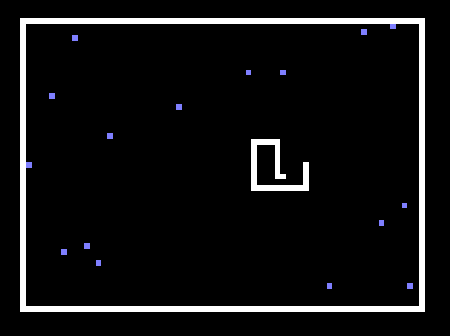
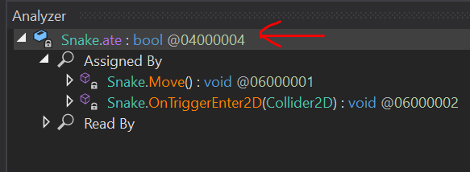

# Unity Hacking 101: Hacking with Reflection

_This tutorial is for Windows machines. Associated materials can be found on GitHub [HERE](https://github.com/MayerDaniel/UnityHacking)_

I recently participated in the [Global Game Jam](https://globalgamejam.org/), where I spent 48 hours creating a game in Unity with a very talented team comprised of game industry professionals and a few novices like me. My contributions were modest and filled with spaghetti but with the help of the great game programmers on my team, I got a much better understanding of the basics of how the engine works. 

Unity is written in C#, a programming language for the .NET framework, which allows us to make use of [Reflection](https://learn.microsoft.com/en-us/dotnet/csharp/programming-guide/concepts/reflection), a very powerful tool set built into .NET which allows for the introspection and manipulation of running processes - we will talk more about this further down. 

Compiled C# also decompiles incredibly cleanly and with symbols, making Unity games a great place to start as well if you are interested in reverse engineering. To get a handle on the basics of Unity though, let's first do some plain ol' forward engineering.

## Snake: A Unity Primer

Behold our target:



To get a basic understanding of how the engine works, I recommend you follow this tutorial to make a very basic snake game:

[Unity 2D Snake Tutorial](https://noobtuts.com/unity/2d-snake-game)

This will get you acquainted with the basic concepts of GameObjects and how C# scripting works within the engine to construct the game logic. 

If you don't want to walk through it though, I have included my build of the game on GitHub [HERE](https://github.com/MayerDaniel/UnityHacking/blob/main/101/snakebuild.zip?raw=true) (clicking this will download the zip file). The only difference between my build and the tutorial is I added the following line to reload the scene when you die:

```cs
SceneManager.LoadScene(SceneManager.GetActiveScene().name);
```

Now that we have our game to hack, let's hack it! Snake is nice because there's only one real way to cheat - we are going to give ourselves more tail squares without eating food! Lets figure out how to do that.

## DNSpy: A first foray into reverse engineering

For this part, we will need to download a .NET decompiler. This will allow us to look at our built snake game to get an idea of what Unity games look like when they are shipped. I recommend DNSpy since it also allows for debugging .NET assemblies relatively easily, even though we won't be doing that in this tutorial. It can be found [HERE](https://github.com/dnSpyEx/dnSpy). You can download a built copy of DNSpy under the "tags" tab on that page:


If you followed the tutorial, first build your game to a known location. Otherwise, unzip [my included build](https://github.com/MayerDaniel/UnityHacking/blob/main/101/snakebuild.zip?raw=true) to a known location. Navigate there and find the file located at `.\snake_Data\Managed\Assembly-CSharp.dll`. For most games, this is the file that holds most of the game logic written by the game designers. Drag this into the sidebar of DNSpy to decompile it.

In the sidebar, you should now be able to open up the default namespace inside of `Assembly-CSharp.dll`, which looks like little brackets with a dash next to them, and inspect the game logic of the classes within our snake game:


The nice thing about mucking around with other people's code is there are no rules about how you accomplish your goals. However you want to get extra snake tails on your dude is up to you. In my case, I took a look at the `Move` function inside the `Snake` class. Here is the decompiled function from DNSpy, copy/pasted here:


```cs
// Token: 0x02000002 RID: 2
public class Snake : MonoBehaviour
{
	// Token: 0x06000001 RID: 1 RVA: 0x00002050 File Offset: 0x00000250
	private void Move()
	{
		this.dir = this.tickDir;
		Vector2 v = base.transform.position;
		base.transform.Translate(this.dir);
		if (this.ate)
		{
			GameObject gameObject = Object.Instantiate<GameObject>(this.tailPrefab, v, Quaternion.identity);
			this.tail.Insert(0, gameObject.transform);
			this.ate = false;
			return;
		}
		if (this.tail.Count > 0)
		{
			this.tail.Last<Transform>().position = v;
			this.tail.Insert(0, this.tail.Last<Transform>());
			this.tail.RemoveAt(this.tail.Count - 1);
		}
	}
```

Great. So a quick look at this shows that within the `Move` function for the boolean `ate`. If it is true, then we add to the tail. That means one way that we can ensure we add a square to our tail is to set `ate` to `true` for our snake, then call `Move`. We've already looked at the move function, so let's check out the `ate` field. Here's where DNSpy is very helpful for reverse engineering. 

You can right click `this.ate` within the `Move` function in DNSpy and select `Analyze` in the menu that pops up. This will create a new analyzer window at the bottom that shows you where `this.ate` gets set and read, but we don't care about that so much because we are going to set it ourselves (checking these out could be another way to accomplish adding a tail, though!). For our method of adding to our tail we care more about the details of the `ate` field itself. For that, click `Snake.ate` in the Analyzer:



This will bring you to its definition within the `Snake` class, which I have included below:

```cs
// Token: 0x04000004 RID: 4
	private bool ate;
```

Ok, so it a boolean, and it is a private variable belonging to the class `Snake`. "Oh no!" you might say - "that means that no function outside the `Snake` class can access that class! This tutorial is over!" to which I say, cut the histrionics! Where there is a will there's a way. And that way is reflection!

## Reflection: The Coolest Part of .NET

Now in game compiled in C, we would probably just find the struct of our `Snake` game object once the game starts and flip the bit associated with the `ate` boolean to true. Which is very cool and hackery and you can check out my other tutorial on [finding and altering offsets in memory](/blog/Process-Injection-102-VirtualProtect) to see how to do something like that. But in .NET you can do something even cooler and hackery. You can write code that goes and alters instantiated objects as a built-in feature!


