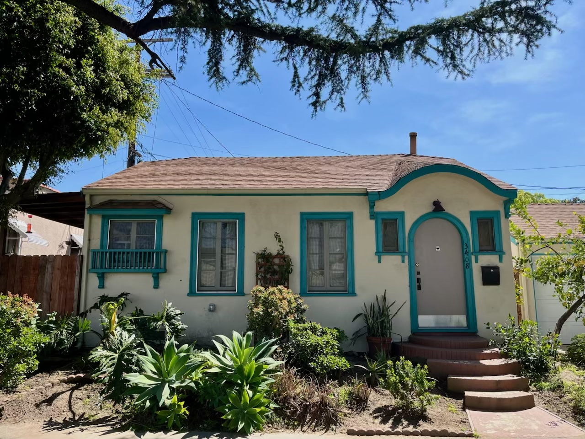
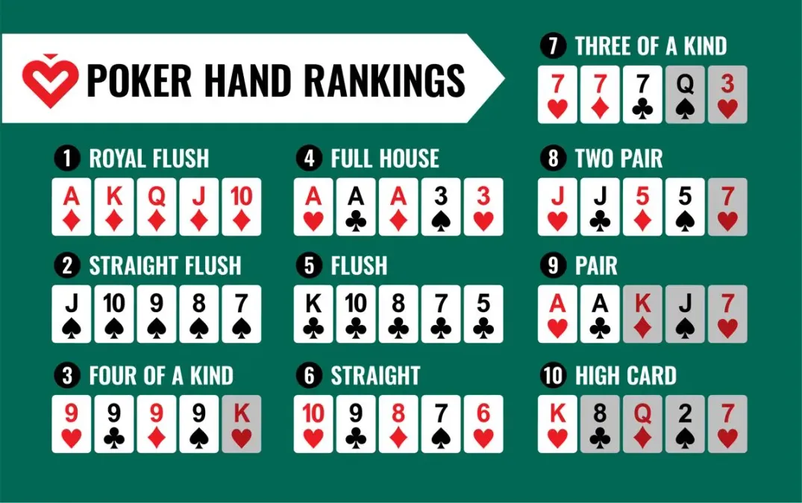

# Poker at the Cottage

## Details 
- **When**: Tonight at 8:00 PM
- **Where**: The Cottage
- **Buy-in**: $10 
- **Blinds**: $0.05/$0.10 to start 
- **Venmo**: [@mayerd](https://account.venmo.com/u/Mayerd)
- **Snacks**: We have chips and veggies, bring something fun if you want. BYOB.

## Chip Breakdown

  <!-- 5c Coin -->

<svg width="100" height="100" viewBox="0 0 100 100">
<circle cx="50" cy="50" r="45" class="circle" fill="white" stroke="black" />
<text x="50" y="50" class="coin-text" font-size="18" fill="black">5c</text>
</svg>

$0.05 x 10 = $0.50

<!-- 10c Coin -->

<svg width="100" height="100" viewBox="0 0 100 100">
<circle cx="50" cy="50" r="45" class="circle" fill="red" stroke="black" />
<text x="50" y="50" class="coin-text" font-size="18" fill="white">10c</text>
</svg>

$0.10 x 10 = $1.00

<!-- 25c Coin -->

<svg width="100" height="100" viewBox="0 0 100 100">
<circle cx="50" cy="50" r="45" class="circle" fill="blue" stroke="black" />
<text x="50" y="50" class="coin-text" font-size="18" fill="white">25c</text>
</svg>

$0.25 x 10 = $2.00

<!-- 50c Coin -->

<svg width="100" height="100" viewBox="0 0 100 100">
<circle cx="50" cy="50" r="45" class="circle" fill="green" stroke="black" />
<text x="50" y="50" class="coin-text" font-size="18" fill="white">50c</text>
</svg>

$0.50 x 5 = $2.50

<!-- 100c Coin -->

<svg width="100" height="100" viewBox="0 0 100 100">
<circle cx="50" cy="50" r="45" class="circle" fill="black" stroke="white" />
<text x="50" y="50" class="coin-text" font-size="18" fill="white">100c</text>
</svg>

$1.00 x 4 = $4.00

<!-- Sum Bar -->

= $10.00

## Primer

Here is a basic primer on how the game is played and what game actions you can take 

<iframe width="560" height="315" src="https://www.youtube.com/embed/GAoR9ji8D6A?si=FTFOVLc5zGYzCo6q" title="YouTube video player" frameborder="0" allow="accelerometer; clipboard-write; encrypted-media; gyroscope; picture-in-picture; web-share" referrerpolicy="origin-when-cross-origin" allowfullscreen style="display: block; margin: 0 auto;"></iframe>

### Hands 

### Dealing/Blind Rotation

Dealer rotates clockwise, with the small blind and big blind being left of them

[!blinds](./blinds.webp)

### Betting Strategy

The basic rule is bet based off of pot odds:

Pot odds are the ratio of the current pot size to the cost of a call. You should call when your odds of winning are better than the pot odds.

<iframe width="560" height="315" src="https://www.youtube.com/embed/_OFM3AAcBD8?si=D-VfD6f_5GlRSsdq" title="YouTube video player" frameborder="0" allow="accelerometer; clipboard-write; encrypted-media; gyroscope; picture-in-picture; web-share" referrerpolicy="origin-when-cross-origin" allowfullscreen style="display: block; margin: 0 auto;"></iframe>