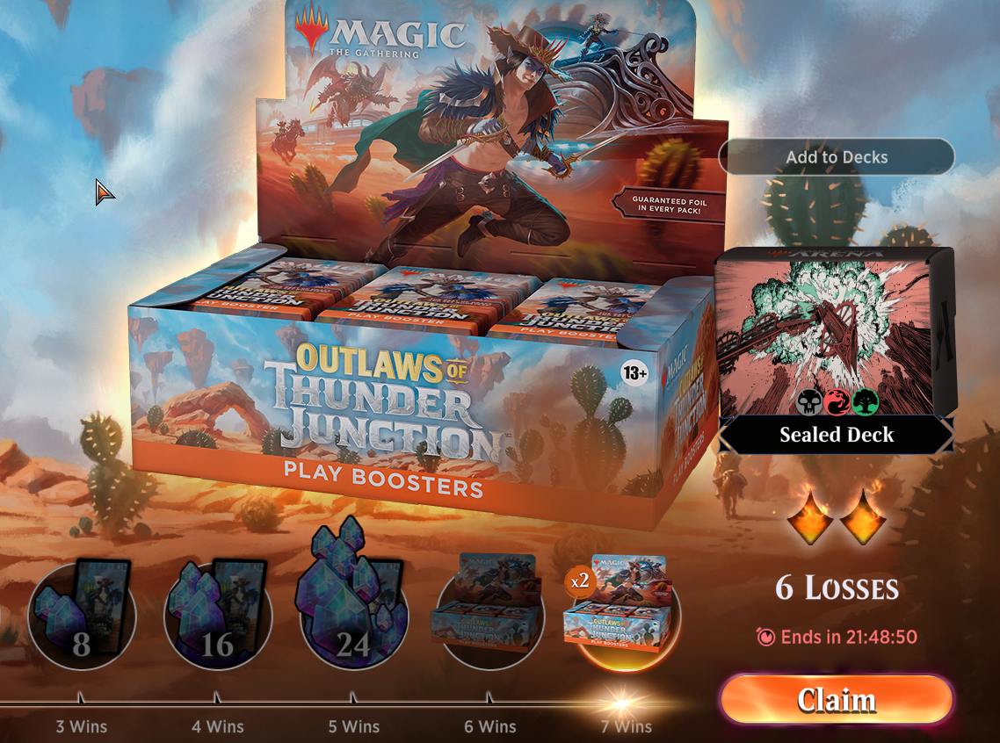

# Hacking MTG: Arena to Never Lose... Again

### TLDR
Client-side validation strikes again, allowing infinite losses in the official tournaments hosted on MTG Arena. Without losses to deter progress, even a terrible player like me can trophy with a ~50% win rate.

Note the 6-out-of-2 allotted losses.

### How it works

I'll make this one brief. If you want to learn more about how I analyze the logic of the game and make mods for it, you can check out my previous two posts about cheats I've made below, where I go into more detail about the process:

[I Hacked Magic the Gathering: Arena for a 100% Winrate](I-Hacked-Magic-the-Gathering/)

[Heisting 20 Million Dollars' Worth of Magic: The Gathering Cards in a Single Request](Heisting-20-Million-in-Magic-Cards/)

I also have a tutorial about how to analyze and mod Unity games if you're looking for step-by-step instructions:

[Unity Hacking 101: Hacking with Reflection](Unity-Hacking-101-Hacking-with-Reflection/)

