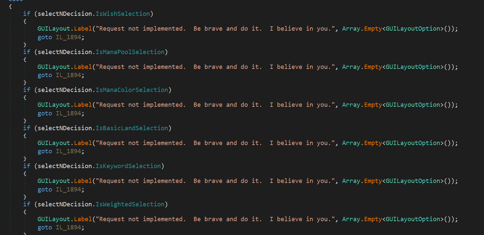
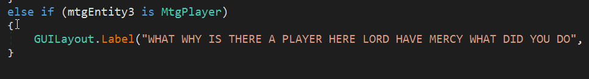
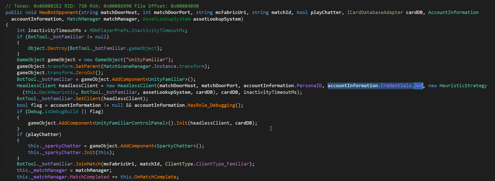
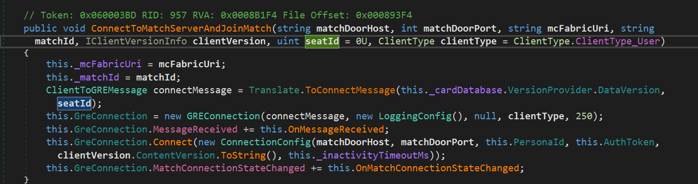

# I Hacked Magic the Gathering: Arena for a 100% Winrate

## TLDR
I could make opponents concede at will so that I never lost a game in Magic: The Gathering Arena

 <video width="100%" controls>
 <source src="concede.mp4#t=0.001" type="video/mp4">
 </video>

<hr>

## Prelude

Before we get into it, I want to address some folks who read my last post and were upset that WOTC doesn't obfuscate their client-side code. I actually think it is really rad that they don't! _Very_ motivated folks (read: people who make paid cheats, botters who sell accounts, etc) will always find ways to deobfuscate and analyze client logic they are interested in anyway. All the obfuscation does is raise the barrier to entry in order keep out less invested folks, which means less hacks overall, sure, but it also means less bored nerds like me who just want to poke at something on the weekend. These bored nerds are the sorts of people who report vulnerabilities that they find! You want these people looking at your game! This is my opinion for most games, but _especially_ card games, because the client does even less than usual.

Card games are usually pretty tough targets for game hacks because they are turn based, and not a lot of information needs to move between the client and the server. This means that card games are excellent candidates for being 100% server-side authoritative, meaning that the server keeps track of the entire game state and only tells the client what it needs to know. 

Unlike a fast-paced shooter where the opponent team's models may need to be loaded before you can see them (allowing for wallhacks), or computationally heavy routines like player movement may be offloaded to the client to save resources (allowing for speedhacks), card games are relatively chill in terms of resource consumption and the information boundaries are concrete. All a player can do is play cards and read the board state, and the server tells the player what they can do and when. 

This means the client will do very little work itself and it will only be given information about unrevealed cards as the cards are played (by an opponent) or drawn (by you). Unrevealed information such as an opponent's hand or the decks never exists locally so they cannot be read. You can't shuffle the deck in a specific order, or change what card you draw. The server just performs these verbs for you and tells you the result. This in stark contrast to something like a first-person shooter, where a player has a lot of verbs and agency available to them at all time. That results in abuses like this:

<blockquote class="twitter-tweet tw-align-center" style="margin: auto;"><p lang="en" dir="ltr">Our MW2 cheat is now done and we&#39;re currently in closed testing. This means our cheat will be ready when the game launches, with all the features you&#39;d expect.<br>Once the game is launched you&#39;ll be able to get our cheat at a discounted price for a limited time, don&#39;t miss it! <a href="https://t.co/65N4T0ieFl">pic.twitter.com/65N4T0ieFl</a></p>&mdash; EngineOwning.to (@engineowningto) <a href="https://twitter.com/engineowningto/status/1574143483392446464?ref_src=twsrc%5Etfw">September 25, 2022</a></blockquote> <script async src="https://platform.twitter.com/widgets.js" charset="utf-8"></script>

In this first-person shooter hack, all that revealed information is already stored and cached within the client - the hack just draws it to screen. Because of the fast-paced and dynamic nature of the game, this information must be available client-side before a player gains line-of-sight to an enemy or object. Otherwise, all of the enemy or object data would have to be sent over the wire realtime at the moment line-of-sight is gained and rendered (and then immediately deleted after line of sight is broken). 

Performance and latency issues get in the way of that. _For now_, at least. Check out Riot's anti-wallhack blog [HERE](https://technology.riotgames.com/news/demolishing-wallhacks-valorants-fog-war) about how they minimized client-side player position data. They are making gains in this realm.

So yeah. In something like a card game, since the actions a player can take are limited and happen at a set time, the client does not need to store data before it is needed. This also makes the logic to detect invalid actions, like playing a card that is not in your hand or out of turn much easier to implement. I think that's part of the reasong why you don't see a big cheating ecosystem around card games the way you do around FPSes. That doesn't mean that bugs don't exist still though! So let's explore one.

## Where to start

For a card game, I thought that the best course of action was to take a look at the network communication. This is a good rule of thumb for game hacking in general - my favorite defcon talk is [just 45 minutes of MMO hacking war stories](https://www.youtube.com/watch?v=ZAUf_ygqsDo) by [Manfred](https://twitter.com/_EBFE). It is really worth a watch. You will see that the root of all the analysis he performs to find all these bugs comes down to reversing the network protocol. He has custom tooling built that hooks whatever function send/recieves messages after they have been decrypted (if there's encryption) and displays the traffic in some sort of hex viewer UI. It also seems like it has the ability to edit the requests before they are sent to the server or interpreted by the client, and replay messages.

Since MTGA is written in C#, the nice thing is that we don't need to do all the fancy stuff he does of hooking the ingress and egress of traffic. Instead, we can very easily manipulate in-game objects at runtime using [reflection](https://learn.microsoft.com/en-us/dotnet/framework/reflection-and-codedom/reflection), including accessing private fields and methods. [I have a basic tutorial on how to do this if you are curious](/writings/Unity-Hacking-101-Hacking-with-Reflection/). All I needed to do was find the client code and start taking a look. From there I could fiddle with the client at runtime as needed.

## A lead

Looking at decompiled C# is also really nice because it utilizes [metadata tokens](https://jorudolph.wordpress.com/2010/08/03/net-metadata-tokens/) to associate elements of the compiled code with their human-readable names, which are still stored in the compiled .NET assembly. That means I can see all the function, variable, and class names that the developers wrote when they wrote their code. It turns the decompilation of non-obfuscated .NET assemblies into essentially source code review!

So I started searching for functions I would associate with joining a match, as that is where I would expect a lot of the client initialization for a specific game against an opponent to begin. Lo and behold, there was a `JoinMatch` function!

This function was quite long (over 200 lines long), and a lot of it was just dealing with the player metadata, like rank, cosmetics, etc. Down at the bottom though, I got what I was looking for:

```cs
private void JoinMatch(NewMatchCreatedConfig matchConfig)
{
    ...
    this._matchManager.ConnectAndJoinMatch(connectionConfig, matchConfig.controllerFabricUri, matchConfig.matchId);
    if (matchConfig.matchType == MatchType.NPE)
    {
        this._npeState.NewNPEOpponent(connectionConfig.MatchDoorHost, connectionConfig.MatchDoorPort, matchConfig.controllerFabricUri, matchConfig.matchId, this._matchManager, this._assetLookupSystem);
        return;
    }
    if (matchConfig.matchType == MatchType.Familiar)
    {
        this._botTool.NewBotOpponent(connectionConfig.MatchDoorHost, connectionConfig.MatchDoorPort, matchConfig.controllerFabricUri, matchConfig.matchId, !flag3, this._cardDatabase, this._accountInformation, this._matchManager, this._assetLookupSystem);
    }
}
```

A function named `ConnectAndJoinMatch` that takes in our match configuration information. Nice. That is likely where our game connects to the match for the first time! ...But that's not all that is there. There are two other checks _after_ we connect to the game server. Do you know what those are?

They are Sparky!

For those unfamiliar with MTGA, Sparky is sort of MTGA's mascot. Embodied as a small wisp of light, Sparky guides new players through the tutorial and are always available to practice new decks against. Essentially, its a cute dressing up of the tutorial and bot match features of MTGA.


Adorable.

Well, I got totally side-tracked by this. Sparky is implemented in a pretty interesting way. As you can see there, if the match type is either `NPE` (which I assume stands for "New Player Experience") or `Familiar` (a standard bot match), other functions are called, which seem to take in a lot of the same information as the function to join a match as a player. Why would that be the case? Because under the hood, any time you play a bot in MTGA, the bot logic runs locally on your machine! It just also connects to the same match server as you, but all the decision-making process for what it is playing runs inside your game running on your computer. 

I was totally surprised by this, because it means that a (mostly) fully-functioning bot capable of playing arbitrary games of Magic: The Gathering has a small enough footprint to run locally on your machine. I would have thought that a game as complex as MTG would require a lot of overhead in terms of creating an AI opponent. But nope! You can actually check out all of the logic for Sparky, including a few places in the debug UI where WOTC developers reached a corner case that they felt was not worth implementing. I don't blame them - MTG is a beast of a game to try to have full coverage for!



Here's my personal favorite, it is reminiscent of the leaked [Valve](https://www.youtube.com/watch?v=k238XpMMn38) and [Yandex](https://www.youtube.com/watch?v=k9uvdTHYNHk) source code comments:



Don't worry anonymous WOTC developer - we've all been there.

## The devil's in the implementation (details)

Let's take a closer look at what exactly happens when you start a bot match:



There's a lot of code here that you don't have to worry about. But check out the highlighted portion. The actual logic handler for the bot is housed inside of a class called `HeadlessClient`. That class is, well, a headless client. The bot doesn't need to render a game board or anything, so it just connects to a game server and plays the game in its brain, like a Magic: The Gathering [Magnuss Carlsen](https://www.youtube.com/watch?v=xmXwdoRG43U). 

Since the headless client is also spawned from your game, it uses the same user credentials to authenticate to the game server - in this case a user ID called `PersonaID` and a [JSON web token](https://jwt.io/) that is granted to your game after you successfully log in. Standard web authenication.

To me that was interesting though, because it means that the game servers don't see anything wrong with the same client essentially connecting to both sides of a match.

Were bot match game servers unique in this regard? I doubted that they were. If that were the case, I didn't think that WOTC would have implemented the bot logic client-side. To me one of the benefits of offloading the bot client is that all game servers can run exactly the same and the clients will worry about connecting, filling the appropriate seats, and interfacing with the server properly.

I mean "seat" literally too! That's how the game keeps track of which player you are, since the credentials are the same for a bot match:



## Match takeovers!

So, as we know from [my tutorial on using reflection to hack unity games](https://www.mayer.cool/writings/Unity-Hacking-101-Hacking-with-Reflection/), we can use game objects to our own ends and alter their behavior. So to test if I could connect to both sides of a _regular_ match, instead of a bot match, I could use a lot of the game logic already written for the bot and matchmaking! I just had to make my own headless client, determine what seat in the game I was, and then connect the client to the other seat. The code I came up with can be found in Appendix A right below this section.

Most of the is just accessing in-game memory objects to get all the information needed to know what game I am currently connected to in matchmaking. I then use that information to connect the bot to the game. Once I have all the info, the code figures out the opponent's seat based off of my own, creates and connects the bot, and as some added spice, immediately makes the bot concede. 

Lo and behold, this worked! Even if the opponent had already connected and we are in the middle of a game, which is what you see in the video. As you can also see, I got rewards as if I beat a human opponent, because this was a matchmaking game:

 <video width="100%" controls>
 <source src="concede.mp4#t=0.001" type="video/mp4">
 </video>

I hope you have a little bit more respect for Sparky now. You can check out the code below if you are interested, but the servers have now been patched to make sure both seats don't have the same account and JWT for matchmaking games.

Thanks for reading, and don't forget to [sign my guestbook.](https://mayerdotcool.123guestbook.com/)

### Appendix A: Instawin code

```cs
using System;
using UnityEngine;
using System.Reflection;
using Wizards.Mtga;
using Wizards.Mtga.Logging;
using WGS.Logging;
using Wotc.Mtga.Cards.Database;
using Wizards.Mtga.FrontDoorModels;
using AssetLookupTree;

namespace hax
{
    public class InstaWin : MonoBehaviour
    {

        //HeadlessClient cheater;
        UnityFamiliar cheatbot;

        // Cast a wide net with our BindingFlags to catch most variables we would run into. Scope this down as needed.
        // https://learn.microsoft.com/en-us/dotnet/api/system.reflection.bindingflags?redirectedfrom=MSDN&view=net-7.0
        BindingFlags flags = BindingFlags.Instance
               | BindingFlags.Public
               | BindingFlags.NonPublic
               | BindingFlags.Static;

        // Create logger for printing to debug log
        UnityLogger logger = new UnityLogger("Tool", LoggerLevel.Debug);

        public void OnStart()
        {
            // Register our logger
            LoggerManager.Register(logger);
        }

        public void OnGUI()
        {
            // Create a window at the center top of our game screen that will hold our button
            Rect windowRect = new Rect(Screen.width - (Screen.width / 6), Screen.height / 10, 120, 50);

            // Register the window. Notice the 3rd parameter is a callback function to make the window, defined below
            windowRect = GUI.Window(0, windowRect, DoMyWindow, "HackBox");

            // Make the contents of the window
            void DoMyWindow(int windowID)
            {
                // Combo line that creates the button and then also will check if it has been pressed
                if (GUI.Button(new Rect(10, 20, 100, 20), "Instawin"))
                {
                    Instawin();
                }
            }
        }

        public Matchmaking GetMatchmaking()
        {
            PAPA papa = GameObject.FindObjectOfType<PAPA>();
            return papa.Matchmaking;
        }

        public void Instawin()
        {

            Matchmaking mm = GetMatchmaking();

            if (mm != null)
            {
                logger.LogDebugForRelease("Matchmaking Exists");
            }

            // Get cached config
            Type matchmakingType = mm.GetType();
            FieldInfo matchConfigField = matchmakingType.GetField("_cachedMatchConfig", flags);
            NewMatchCreatedConfig config = (NewMatchCreatedConfig)matchConfigField.GetValue(mm);

            logger.LogDebugForRelease(String.Format("config.matchEndpointHost: {0}", config.matchEndpointHost));
            logger.LogDebugForRelease(String.Format("config.matchEndpointPort: {0}", config.matchEndpointPort));
            logger.LogDebugForRelease(String.Format("config.controllerFabricUri: {0}", config.controllerFabricUri));
            logger.LogDebugForRelease(String.Format("config.matchId: {0}", config.matchId));

            // Get account information
            FieldInfo accountInformationField = matchmakingType.GetField("_accountInformation", flags);
            AccountInformation ai = (AccountInformation)accountInformationField.GetValue(mm);

            logger.LogDebugForRelease(String.Format("ai.PersonaID: {0}", ai.PersonaID));
            logger.LogDebugForRelease(String.Format("ai.Credentials.Jwt: {0}", ai.Credentials.Jwt));

            // Get card database
            CardDatabase cdb = Pantry.Get<CardDatabase>(Pantry.Scope.Application);

            if (cdb == null)
            {
                logger.LogDebugForRelease(String.Format("cdb is null: ", cdb));
            }

            logger.LogDebugForRelease(String.Format("cdb.VersionProvider.DataVersion: {0}", cdb.VersionProvider.DataVersion));

            // Get Match Manager
            FieldInfo matchManagerField = matchmakingType.GetField("_matchManager", flags);
            MatchManager man = (MatchManager)matchManagerField.GetValue(mm);

            // Get Match Manager
            FieldInfo assetLookupSystemField = matchmakingType.GetField("_assetLookupSystem", flags);
            AssetLookupSystem ass = (AssetLookupSystem)assetLookupSystemField.GetValue(mm);

            logger.LogDebugForRelease(String.Format("ass.Blackboard.ContentVersion: {0}", ass.Blackboard.ContentVersion));

            // Get other seat
            uint otherSeat = man.LocalPlayerSeatId % 2U + 1U;

            UnityFamiliar.SpawnFamiliar_DEBUG(cdb, config.matchEndpointHost, config.matchEndpointPort, ai.PersonaID, ai.Credentials.Jwt, config.controllerFabricUri, config.matchId, otherSeat, null);

            cheatbot = UnityEngine.Object.FindObjectOfType<UnityFamiliar>();

            cheatbot.Client.Gre.ConcedeGame();
            

        }

    }
}
```