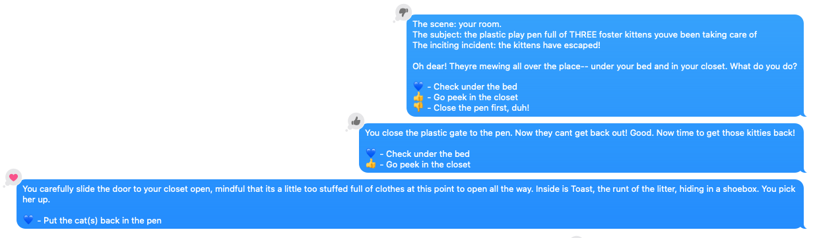
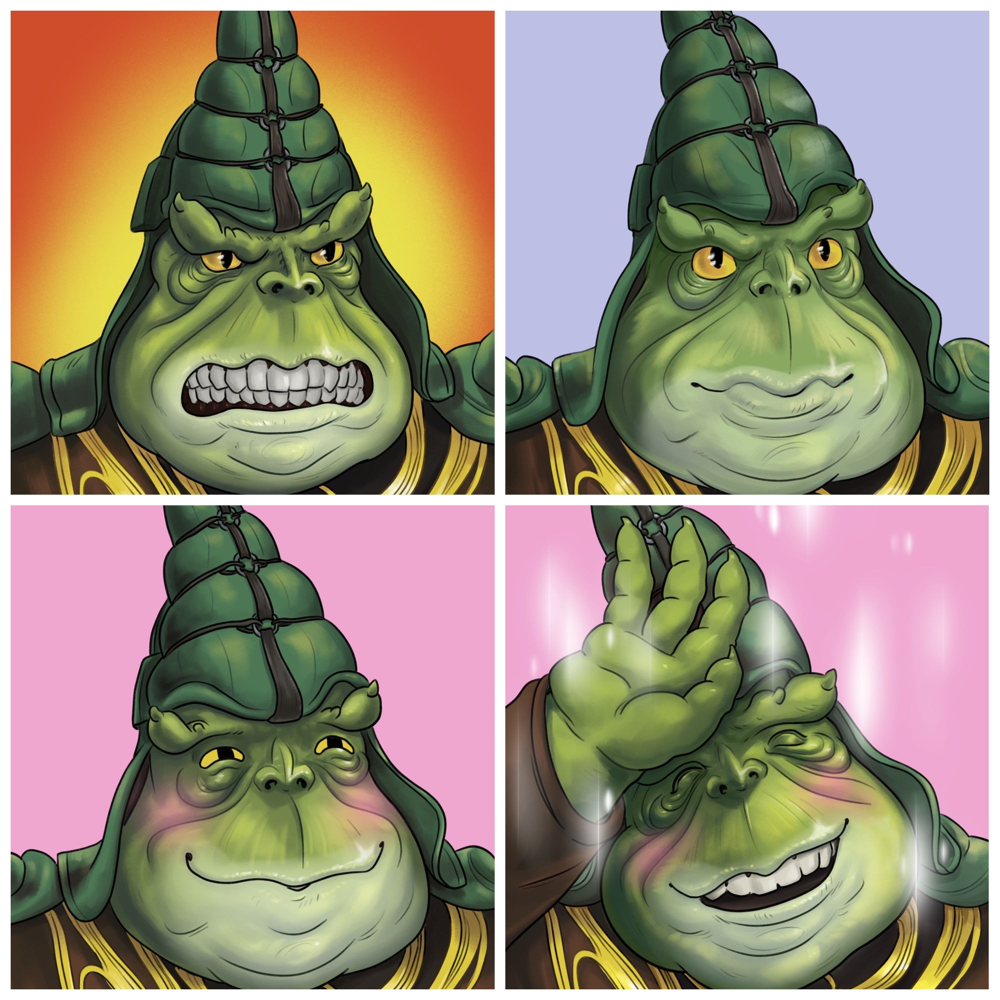
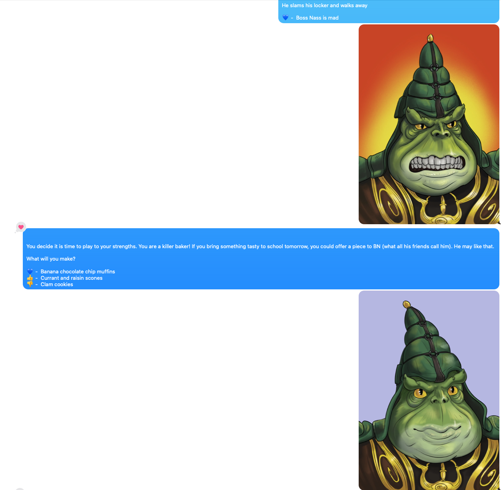

# Text Your Friends Choose-Your-Own-Adventure Games with iMessage and Twine

The code associated with this blog post can be found [HERE](https://github.com/MayerDaniel/twine-text)

### TLDR 

iMessage works as a great [Twine game](https://twinery.org/) interface because the iMessage reactions give the reader up to six options to choose from when reacting to a given message. So long as each node of your story has less than six branches, you can use [this python script](https://github.com/MayerDaniel/twine-text) on a Mac to turn any Twine game into a fun adventure you can text to your friends, where they use the reactions to chose their own adventure!


The end result looks like this - the player chooses the appropriate to reaction to make their selection and get the next prompt.

<hr>

## Intro

I have made a little tradition for myself where each anniversary with my partner I gift her some sort of weird outsider art revolving around Boss Nass, the ruler of the Gungans from Star Wars: The Phantom Menace. There was once an inside joke in their somewhere, but it has been lost to the sands of time, and only this strange ritual remains as a vestige. Previous gifts have included commisioned portraits, my own poor renderings, and even a giant statue of him in her honor on [the oldest anarchy server in minecraft](https://2b2t.miraheze.org/wiki/Front_Page).

 <video width="100%" controls>
 <source src="statue.mp4#t=0.001" type="video/mp4">
 </video>

(I should probably say here that she loves this tradition and touts this one in particular as one of her favorite gifts she's ever received)

So this year for the Boss Nass gift of choice, I collaborated with a good friend of ours, [Rob Negrete](https://www.instagram.com/robthesentinel/) to create a dating sim where she has to woo Boss Nass and ask him to the Sadie Hawkin's dance in three days. He made me four great renderings of Boss Nass in various states of infatuation (seen below), and I went about devising a dating sim in Twine, and figuring out how to present it to her in a fun way!



I had already done some work automating iMessages to [make a chatbot that lived in my group chats](/writings/creating-an-imessage-chatbot/), so it seemed like the perfect medium to use, especially since then I could just send it to her out of the blue as opposed to having to get her to sit down in front of my computer. It worked great! Here is it in action:



This was a lot of fun to both make and play, so I made the [code available](https://github.com/MayerDaniel/twine-text) and have written these steps on how you can make your own! I guarantee your friends will love it!

## Step 1: Make the Twine Game

This is frankly the hardest part. Make a premise, write out all the different branches, and hopefully make it fun. My final twine game ended up looking like this - pretty short and sweet:


Remember to limit yourself to six branches at each node, as that is the number of reactions that exist in iMessage.

## Step 2: Convert it to JSON with twine-graph

For those who have never made a Twine game before, it is your basic chose-your-own adventure. You give players a prompt and set of choices, and then they make a choice that brings them to a new prompt. 

The cool thing about Twine is that the exported game is a single HTML file that interactively plays when you open it. It is the fastest, easiest way to get into game making! For our needs though, we need it in a simpler structured format. Thankfully [twine-graph](https://pypi.org/project/twine-graph/) exists for this exact purpose! Once it is installed, you just point it at a Twine html file and it will spit out the game as a JSON file:

```bash
twine_graph mygame.html
```

## Step 3: Allow terminal the necessary access to send and receive iMessages

MacOS doesn't like programs accessing data or performing actions on your behalf that may be invasive. Reading and sending your text messages definitely fall into that category, so we need to allow our program to have those permissions.

Under "Privacy and Security" in your system settings on MacOS, enable whatever terminal you use to have "full disk access" (for reading messages) and "accessibiliy" (for sending messages) permissions:


In the future, this could open you up to security issues if you ever curl something untrusted and pipe it straight into bash, for example. Strangely that isn't that uncommon to do for installing open source software nowadays, so if that is a worry just be sure to come back and toggle these off after you are done running your adventure!

## Step 4: Configure what numbers you want to send the first adventure prompt to and let 'er rip!

Clone the [twine-text repo](https://github.com/MayerDaniel/twine-text). You will need to input any numbers you want to start the game with on [this line in the code](https://github.com/MayerDaniel/twine-text/blob/aa5299ec21487dc1991efbd18af4a4ec2694622e/start_adventure.py#L24)

Note that you can have multiple phone numbers by just adding a new line with a new number like so:

```python
self.Adv.start_adventure('XXXXXXXXXX') # Number 1
self.Adv.start_adventure('XXXXXXXXXX') # Number 2
```
If you have a bunch you want to run at the same time, you could even make an array to loop over starting it. I haven't tested it with many concurrent adventures though - I'd be curious to hear how it goes!

Once you have your numbers in you can start the adventure like so:

```bash
python3 start_adventure.py example_twine.json
```
Change `example_twine.json` to your Twine's json file to use your adventure instead of the example!  If you just want to test it out without making your own Twine game, just use that example json. 

And there you have it! The script will then monitor those numbers for incoming reactions and send the appropriate next choice.

## Caveats

#### Sending images
You will notice that the code on GitHub does not handle sending images like I have in mine. That is because there isn't an easy generalizable way to do it. I bubblegum-and-shoestringed mine together by having specific strings like ("MAD") that I put in each node of my story associated with the different emotions, and then I would replace that string with the empty string and send the appropriate image. 

The image sending code I used is from [here](https://stackoverflow.com/a/52975896). Note that I was only able to send images that were in the directory `/Users/<user>/Pictures/` - it seems to be another weird security quirk.

#### Sending messages to yourself

I don't recommend testing this script by sending messages to yourself. It seems to fail intermitently and since the reactions double up the actual option selection gets buggy as well. I'm sure your friend of choice won't mind you spamming their phone too much!

## Conclusion

I hope that this program brings some small joy into your life. Little "toy" programs like this help me remember how cool it is that we can control computers, now that they are so ubiquitous. Turn something mundane into something new and fun! Maybe it can help you ask out a cutie on a date, or let an old friend "win" a lunch on you! 

As always, thanks for reading, and [don't forget to sign my guestbook!](https://users3.smartgb.com/g/g.php?a=s&i=g36-36443-57)