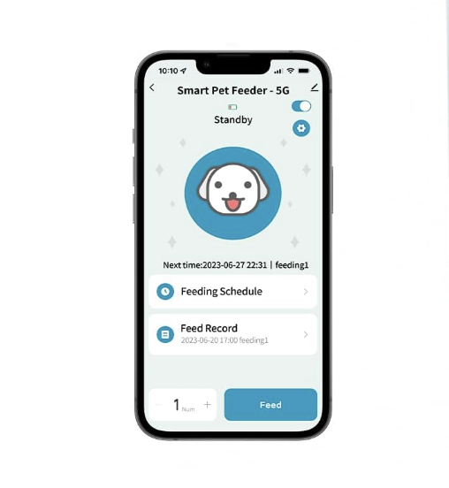

# Pavlov's Half Marathon: Training Myself to Run More with Classical Conditioning

### TLDR

I bought an IOT dog food dispenser, filled it with M&Ms, and made a script checks the Strava API to see if I ran a sufficient distance. If I did, I got a reward like the good boy I was. This ended up being far and away the most effective running program I have ever implemented for myself. I now run long distances regularly, recently completed a half marathon (13.1 miles), and don't even use the M&M dispenser any more. Kind of like how your dog still sits even though you don't give him a treat for doing so anymore!

PUT VIDEO OF DOG FEEDER HERE - SHOULD BE IN IMOVIE

### Why

Recently, I have accepted that I have become an adult. My adulthood litmus test has always been the following:
> If you know what date it is every day, you are an adult.

Well, turns out this is wrong. I now know that what being an adult _really_ means is that most of your time is taken up by an ever-growing list of compulsory maintenance tasks that constitute the meager amount of contol you exert over your own life. And I still don't even know what the date is! Turns out that was merely my justification for being a terrible planner and meeting attender - ✨child at heart✨!

Part of understanding that I am now an adult meant readjusting what it means to exercise. I love going to the gym and spending a lot of time there, but I found myself doing it less and less, mostly because big blocks of time stopped presenting themselves to me. 

I accepted that I must become like all the other busy looking men I see in Griffith Park: somehow awake and alert before 9 am to get more time out of the day, brow humid and furrowed above their blue reflective wraparound sunglasses; egg-smooth legs effortlessly powering them onwards as if pulled by some invisible wire attached to the sharp nipples seen piercing through their jogging quarter zips. I had to become a runner.

I have a love-hate relationship with running. I used to be a fat kid, and I changed that the summer before I went to college by running along the streetcar track in New Orleans's balmy 100-degree, 100% humidity days at noon. It was the most successful weight loss regimine I ever had, and I'm happy to say I've never needed another one like it. That said, it did not instill a fondness for running in me. I still can't listen to my 2014 running playlist without feeling mildly heat struck.

<iframe width="560" height="315" src="https://www.youtube.com/embed/4wIGITl8hC4?si=0JzitkT5rAqJLhk0" title="YouTube video player" frameborder="0" allow="accelerometer; autoplay; clipboard-write; encrypted-media; gyroscope; picture-in-picture; web-share" referrerpolicy="strict-origin-when-cross-origin" allowfullscreen></iframe>

<p style="font:10px">This is the sound of me never wearing cargo shorts again.</p>

I knew I had to do something different this time. Running was no longer a means to and end, I needed it to be a sustainable part of my life. Thankfully, I knew just the solution for how to acclimate myself. 

I used to work as a Zoo, and Zoo keepers and vets have to get animals of varying intelligence (Giraffes are like a house for sale - the lights are on but nobody's home) to move certain places and do certain things, like stay on a scale to get weighed. What was the answer? Target training!

You can get all sorts of animals to do basic things like touch their nose to a target (usually a stick with a bright colored bulb at the end of it) if they know they will get food after doing it. This is due to the proven principles of classical conditioning, whereby you can get an animal to associate neutral stimuli (a wand with a yellow bulb at the end) with a desired response (touch nose to bulb) through rewarding them with positive reinforcement (food) every time they do the desired response.

Well, what am I but another food-motivated, dumb animal? It was time to associate running long distances with treats and get myself conditioned!

### How 

#### The feeder

I knew I would need to get a food dispenser that I could control, so I sought out to find the shittiest, most cheaply made looking IOT dog food dispenser on Amazon. My rationale was that it would have the worst security around whatever protocol it used to trigger the feeding, so I could easily replay whatver data was being sent to it when I wanted to. I landed on [this one](https://www.amazon.com/dp/B0CQL2KH7R?ref=ppx_yo2ov_dt_b_fed_asin_title&th=1) because I could see the app in the photo and boy did it look like the right vibe:



Turns out, I didn't have to do any reverse engineering or MitM traffic at all! This dog feeder happened to be part of the [Smart Life](https://ismartlife.me/) ecosystem (careful with that link - I don't know if that is the real website). Smart Life is an offshoot of [Tuya](https://www.tuya.com/), a smart home product company with a fair amount of developer support! Setting up programmatic with it ended up being super easy, mostly thanks to the hard work of the maintainers of [tinytuya](https://github.com/jasonacox/tinytuya).

#### tinytuya 

[tinytuya](https://github.com/jasonacox/tinytuya) is a Python module designed to allow programtic control of Tuya devices via Python. The UX of this Python module is incredible. There is a mildly convoluted setup process you need to go through to get you device's "secret key" to allow for the use of tinytuya, but the documentation is verbose and easy to follow, and the module even comes with a [setup wizard](https://github.com/jasonacox/tinytuya?tab=readme-ov-file#setup-wizard---getting-local-keys) that will scan your local net to find any Tuya devices. Once everything was set up, I could dispense food at will using the following script:

```python
import tinytuya

# Connect to Tuya Cloud
c = tinytuya.Cloud(
        apiRegion="us", 
        apiKey="XXXXXXXXXXXXXXXXXXXXXXXX", 
        apiSecret="XXXXXXXXXXXXXXXXXXXXXXXX", 
        apiDeviceID="XXXXXXXXXXXXXXXXXXXXXXXX")

# Display list of devices
devices = c.getdevices()
print("Device List: %r" % devices)

# Select a Device ID to Test
id = "XXXXXXXXXXXXXXXXXXXXXXXX"

# Display Properties of Device
result = c.getproperties(id)
print("Properties of device:\n", result)

# Display Status of Device
result = c.getstatus(id)
print("Status of device:\n", result)

# Send Command - Dog Food!
commands = {
    "commands": [
        {"code": "manual_feed", "value": 1},
    ]
}
print("Sending command...")
result = c.sendcommand(id,commands)
print("Results\n:", result)
```

Note that this goes through their cloud service, which means you have to have this device connected to the internet which I know skeeves some folks out. If you wanted to have this thing completely isolated though, you could have a no-outbound-internet subnet with this device on it so long as the device you are going to run the script on has line-of-sight. You can do this because Tuya devices have a local-only protocol that tinytuya supports, so you can send commands just within your LAN. This is what I ended up using for my final application (see next section), but I also didn't take any precaution with walling off the dog feeder. If it port scanned my house at some point and shipped the data somewhere, so be it. 

#### Strava

The Strava API is also quite friendly - I used [stravalib](https://github.com/stravalib/stravalib) to interface with it. The only hangup with Strava is that it only allows for authentication via oauth, with tokens that only last 6 hours once minted. This means that instead of having a little script that held an API token to hit the Strava API, I had to make a minimal webserver to both redirect to the oauth page and catch the auth code after successful authentication. This ended up being pretty nice though because it meant that I could run the program from my phone! There was also a bit of legwork [setting up an "application" with Strava](https://medium.com/analytics-vidhya/accessing-user-data-via-the-strava-api-using-stravalib-d5bee7fdde17) to be able to hit the API.

At the end, the Python code relevant to Strava looked like this. The domain you see referenced, `food.mayer.cool` just points to a local IP I assigned to my flask server. I believe this could just be a local IP or localhost, I just made an A record in namecheap so I could remember it and type it into my phone easily.

```python
import flask
from stravalib import unithelper
from stravalib.client import Client

client = Client()  
app = flask.Flask(__name__)

# Start the oauth flow
@app.route("/start")
def start():
    authorize_url = client.authorization_url(
        client_id=XXXXXX, redirect_uri="http://food.mayer.cool:8282/authorized"
    )
    return flask.redirect(authorize_url)

# Catch the oauth flow and print data about the most recent run
@app.route("/authorized")
def authorized():
    # Have the user click the authorization URL, a 'code' param will be added to the redirect_uri
    # .....
    code = flask.request.args.get("code")
    
    token_response = client.exchange_code_for_token(
        client_id=XXXXXX, client_secret="XXXXXXXXXXXXXXXXXXXXX", code=code
    )
    # Pull out auth material
    access_token = token_response["access_token"]
    refresh_token = token_response["refresh_token"]
    expires_at = token_response["expires_at"]

    # Set auth material in the client
    client.access_token = access_token
    client.refresh_token = refresh_token
    client.token_expires_at = expires_at

    # Get my data
    athlete = client.get_athlete()
    most_recent = next(client.get_activities(limit=1))

    # use unithelper to convert distance to miles
    print(f"Miles ran: {unithelper.miles(most_recent.distance)}")
```

Gluing the two pieces together, I could set how long I needed to run (I hardcoded it and changed it as I progressed), check Strava, and dispense a treat for myself. I used pickled data to keep track of when I last ran to ensure that I only got one set of M&Ms per run.

My complete script ended up looking like this:

```python
import datetime
import flask
import json
import pickle
import requests
import tinytuya
from stravalib import unithelper
from stravalib.client import Client

client = Client()  
app = flask.Flask(__name__)

@app.route("/authorized")
def authorized():
    # Have the user click the authorization URL, a 'code' param will be added to the redirect_uri
    # .....
    code = flask.request.args.get("code")

    token_response = client.exchange_code_for_token(
        client_id=XXXXX, client_secret="XXXXXXXXXXXXXXXXXX", code=code
    )
    # Pull out auth material
    access_token = token_response["access_token"]
    refresh_token = token_response["refresh_token"]
    expires_at = token_response["expires_at"]

    # Set auth material in the client
    client.access_token = access_token
    client.refresh_token = refresh_token
    client.token_expires_at = expires_at

    # Get my data
    athlete = client.get_athlete()
    most_recent = next(client.get_activities(limit=1))

    # Check distance
    distance = 4
    if unithelper.miles(most_recent.distance).magnitude < distance:
        return f"You need to run at least {distance} miles to deserve a treat!"

    # Check pickle file to see if we've already fed for this run
    try:
        with open('last_run_time.pkl', 'rb') as f:
            last_run_time = pickle.load(f)
    except FileNotFoundError:
        last_run_time = datetime.datetime(1900, 7, 28, 19, 7, 56, tzinfo=datetime.timezone.utc)

    if most_recent.start_date <= last_run_time:
        return "You've already been fed for this run!"

    # connect to the device locally
    d = tinytuya.Device('XXXXXXXXXXX', '192.168.1.XXX', 'XXXXXXXXXXXX', version=3.4)
    data = d.status()  

    # Show status and state of first controlled switch on device
    print('Dictionary %r' % data)

    # Locally we can just set the oid 3 to a value of 1, which will dispence one round of M&Ms
    d.set_value(3,1)

    # Save current time as pickle file
    with open('last_run_time.pkl', 'wb') as f:
        pickle.dump(most_recent.start_date, f)


    return "Authorization successful"

@app.route("/start")
def start():
    authorize_url = client.authorization_url(
        client_id=119442, redirect_uri="http://food.mayer.cool:8282/authorized"
    )
    return flask.redirect(authorize_url)


if __name__ == "__main__":
    print("Starting server...")
    print("Go to http://food.mayer.cool:8282/start to begin the authorization process")
    app.run(host="0.0.0.0", port=8282)

```

And there you have it! Your very own treat dispenser. This same flow could be used to track and reward progress on all sorts of stuff, not just run distance. Budgeting, git commits, you name it. Anything with a digital form of tracking and can give immediate feedback for can be "trained" in the same way!

### Efficacy

Ok, I know what you are thinking: "This is so stupid, why didn't Dan just open up the top of the feeder, or go buy M&Ms when he wanted them? Isn't human free will more powerful than being trained like a dog?" 

And I think that obviously this will depend on the person, but for me personally, the answer is no. Bare with me as I get a little bit philosphical. Here are my thoughts on this after living with it for a few months:

#### We are creatures of habit 

This one is pretty basic and I can only speak for myself, but I mostly do the same stuff every day. "Free will" doesn't factor into quotidian life much, the "decisions" you make are much more subtle and implicit - you don't think about opening up your phone when you are bored, you just do. That was my goal with running - I wanted it to become something I just do.

 I don't usually keep M&Ms in the house and am not in the habit of eating them, so I didn't feel a deep urge to "cheat". I instead was building a completely new habit where I ate M&Ms after achieving a goal. The wires never got crossed in my brain where the M&Ms became the goal, they became a small positive association, but that was it. Having a small positive association was all the difference though. See point 2:

#### We know what we want, but cost-benefit is out of wack

The world is designed to lure us into forming bad habits. Food companies, entertainment companies, brokerages, and just about everything else at this point has been hyper-optimized to form positive associations in our animal brain with consumption. This is a tough system to live in, because our aspirations are usually more nebulous than "feel good", which is what the products promise us. Our aspirations do not easily produce positive associations that immediately form. In the case of running, when I tell myself I want to run, it is because I want to stay healthy, minimize my chances of chronic pain, and have a more sustainable, balanced life. None of those things give me immediate gratification the same way I would have if I sat down and played a very stimulating video game instead of running. 

Does that mean that I actually want to play an hour of Magic: The Gathering Arena instead of running? No. It just means that the designers of free-to-play games now have 30+ years of research backing up how to make their game feel as good as possible to play, and how to deliver immediate positive feedback when I play it to keep me coming back. Running is a much simpler activity, and no one is engineering it to make me feel like I am having a good time when I engage with it - in fact I usually actively feel neutral to bad. So when my brain is making one of those subtle, implicit decisions it doesn't see a lot of benefit from going running. Running is going to be hard, and it is unclear what I will really get out of it. Arena is easy to access, and I will get a bunch of dopamine hits while playing! Multiply this dilemma by every decision we make day-to-day, and you see why so many folks have developed bad habits. It is an unfair fight. Our aspirations hardly stand a chance.

Attaching a small, mostly symbolic reward to achieving my goals helped me level the playing field. After setting up the dispenser, when my brain weighed those options, running still looked hard, but there was also a small concrete dopamine hit associated with it. Achieving my goals _is what I wanted deep down_, and it was now easier to convince my animal brain that it was in its best interest too. 

The best part is, after you have trained your dog to sit, he will still sit long after your stop feeding him treats. It appears I am no different. I have stopped using the M&M dispenser, but I am still running regularly.


